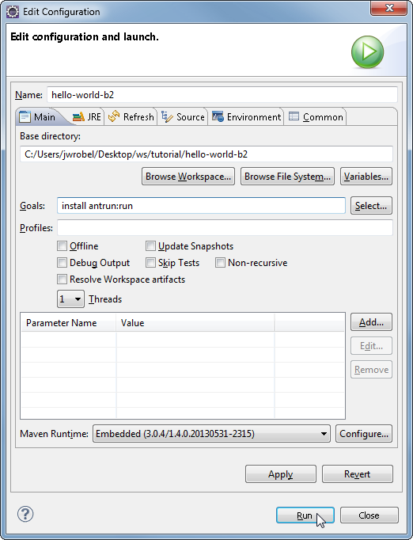

#Basic Maven B2 Tutorial 
##Prerequisites
* A running Blackboard Developer VM on [http://localhost:9876](http://localhost:9876). This was covered in the 
[BBDeveloperVMSetupTutorial](BBDeveloperVMSetupTutorial.md)

##Introduction
This tutorial shows how to create and deploy a basic B2 to Blackboard. The most basic 
mavenized B2 will have the following files:

* **pom.xml** - Maven's [Project Object Model][pom]. After created, 
  B2 deployment is a single step procedure. Much of it can be reused.
  add properties
* **src/main/webapp/WEB-INF/web.xml** - Web Application Deployment 
  Descriptor of your application [see explanation][webxml].
* **src/main/webapp/WEB-INF/bb-manifest.xml** - This is a blackboard 
  specific file. It describes how your B2 is to be integrated into 
  blackboard. Further details have been documented in this
  [bb-manifest.xml reference.][bbmanifestref]. 
* **src/main/webapp/home.jsp** - just a simple a [jsp][jsp]. 

[pom]: https://maven.apache.org/pom.html#What_is_the_POM
[webxml]: http://stackoverflow.com/a/2412983/792789
[jsp]: http://stackoverflow.com/questions/3216497/looking-for-a-good-tutorial-on-jsp-struts-2#3216552
[jsptag]: http://stackoverflow.com/questions/1296235/jsp-tricks-to-make-templating-easier#3257426
[bbmanifestref]: https://docs.alltheducks.com/blackboard/bb-manifest-ref.html

##Tutorial
For those already familiar with B2 development [here is a zip archive of the completed project](https://github.com/justinwrobel/bbmd/raw/master/BasicMavenB2Tutorial/hello-world-b2.zip). Just extract, import into eclipse and skip to the [Deploy!](#deploy) section.

###Create new Maven Project in Eclipse 

1. Navigate to **File** > **New** > **Other...** to create a new Maven project. 
2. Select **Maven Project** and then Click **Next** in the **Select a Wizard** dialog box 
3. Enable **Create a simple Project...** and then Click **Next** in the **New Maven Project** Dialog box 
4. Fill out the following in the second **New Maven project** Dialog
	* Group Id: com.justinwrobel
	* Artifact Id: hello-world-b2
	* Version: 0.0.1-SNAPSHOT
	* Packaging: war
	* Name: Hello World B2

Maven should have created the following file structure and files:

##Create a B2
Start by adding the following to **src/main/webapp/hello.jsp**:

    <!DOCTYPE html>
    <html>
		<head>
			<title>Hello</title>
		</head>
		<body>
			Hello World!
		</body>
    </html>

Add the following to **src/main/webapp/WEB-INF/web.xml** (create the **WEB-INF** directory, if not there already)

	<?xml version="1.0" encoding="UTF-8"?>
	<web-app version="2.5" xmlns="http://java.sun.com/xml/ns/javaee"
		xmlns:xsi="http://www.w3.org/2001/XMLSchema-instance"
		xsi:schemaLocation="http://java.sun.com/xml/ns/javaee http://java.sun.com/xml/ns/javaee/web-app_2_5.xsd">
	
	</web-app>

Add the following to **src/main/webapp/WEB-INF/bb-manifest.xml**

	<?xml version="1.0" encoding="UTF-8"?>
	<manifest xmlns="http://www.blackboard.com/bb-manifest-plugin"
		xmlns:xsi="http://www.w3.org/2001/XMLSchema-instance"
		xsi:schemaLocation="http://www.blackboard.com/bb-manifest-plugin http://fibbba.blackboard.com/xsd/bb-manifest-plugin.xsd">
		<plugin>
			<name value="hello-world-b2" />
			<description value="My first B2 - Hello World!" />
			<default-locale value="en_US" />
			<webapp-type value="javaext"/>
			<!-- handle value will be part of the B2's url please see -->
			<!-- https://github.com/justinwrobel/bbmd/blob/master/B2UrlAnatomy.md -->
			<!-- for more information -->
			<handle value="hello-world-b2" />
			<version value="0.0.1" />
			<requires>
					<bbversion value="8.0" />
			</requires>
			
			<!-- vendor id will be part of the B2's url please see -->
			<!-- https://github.com/justinwrobel/bbmd/blob/master/B2UrlAnatomy.md -->
			<!-- for more information -->
			<vendor>
				<id value="jw" /> <!-- id is limited to 4 chars -->
				<name value="justinwrobel" />
				<url value="http://www.githut.com/justinwrobel" />
			</vendor>
			
			<!-- This application will be available at -->
			<!-- http://${bbhost}/webapps/jw-hello-world-b2-BBLEARN -->
			
			<!-- the application-defs element is where the integration points between -->
			<!-- Blackboard and the webapp are defined. -->
			<application-defs>
				<application handle="hello-world-system" type="shared"
					use-ssl="false" name="Hello World to the System">
					<links>
						<link>
							<type value="system_tool" />
							<name value="Hello World System Link" />
							<description value="Hello World System Description" />
							<url value="hello.jsp" />
						</link>
					</links>
				</application>
			</application-defs>
		</plugin>
	</manifest>

Congratulations! You've just created your first B2!  

##Test build & Manually Deploy
1. Right click **hello-world-b2** and then select **Run as...** > **install** 
   to Build the war file 
1. Open a browser to localhost:9876
1. Sign in as Administrator/password
1. Navigate to **System Admin**
1. Navigate to **Building Blocks**
1. Navigate to **Installed Tools**
1. Click the **Upload Building Blocks** button
1. Click Browse and select Workspace/hello-world-b2/target/hello-world-b2-0.0.1-SNAPSHOT.war
1. Click Submit on the **Install Building Block**
1. Click Approve on the **Install Building Blocks and Make Building Blocks Available** page
1. Wait for B2 to install then Click the **Return** button.
1. Navigate to System Admin tab
1. Click the **Hello World System Link** link (it should point to [http://localhost:9876/webapps/jw-hello-world-BBLEARN/hello.jsp](http://localhost:9876/webapps/jw-hello-world-BBLEARN/hello.jsp))

We could stop at this point and use this method to deploy but 
we would have to manually deploy the war file each time. 
The manual deployment process is **over 9 steps** and it takes over a minute. **Each time**.
Why would we do that when Maven can simplify the entire process 
down to one command and speed up deployment to just a few seconds.

##Add the b2deploy-task to our build

1. Add pluginRepositories to pom.xml for b2deploy-task
	
		<project...
		...
		<pluginRepositories>
			<pluginRepository>
				<id>blackboard-repo</id>
				<name>Blackboard Repository</name>
				<url>https://bbprepo.blackboard.com/content/repositories/releases/</url>
			</pluginRepository>
		</pluginRepositories>
		...
		</project>
	
1. Add maven-antrun-plugin, b2deploy-task to the build section
	
		<project...
		...
		<build>
			<plugins>
				<!-- The following task automatically uploads the war file to blackboard. -->
				<!-- It is called by executing 'mvn antrun:run' -->
				<plugin>
					<artifactId>maven-antrun-plugin</artifactId>
					<version>1.5</version>
					<dependencies>
						<dependency>
							<groupId>org.oscelot</groupId>
							<artifactId>b2deploy-task</artifactId>
							<version>0.1.0</version>
						</dependency>
					</dependencies>
					<configuration>
						<!-- The b2deploy task automatically deploys the war file onto the -->
						<!-- development server so you don't have to. -->
						<target>
							<taskdef name="b2deploy" classpathref="maven.plugin.classpath" classname="org.oscelot.ant.B2DeployTask" />
							<b2deploy localfilepath="${project.build.directory}/${project.build.finalName}.war" host="${bbhost}" courseorgavailable="true" clean="true" />
						</target>
						<!-- Requires "Starting Block" installed on the server. -->
						<!-- Download the war file from -->
						<!-- http://behind.blackboard.com/downloads/details.aspx?d=1669 -->
					</configuration>
				</plugin>
			</plugins>
		</build>
		...
		</project>

##Deploy!
	
1. Right click on the project and choose **Run As** > **Maven Build** 
	
	

1. In the **Edit configuration** dialog box set Goals to `install antrun:run` and Click **Run**! 

	 

	If you get the `OK` message after the `Installing: ...` message it should be installed. 
	

1. Finally, you can either navigate directly to  [http://localhost:9876/webapps/jw-hello-world-b2-BBLEARN/hello.jsp](http://localhost:9876/webapps/jw-hello-world-b2-BBLEARN/hello.jsp)
or click the **Hello World System Link** under **Tools and Utilities** on the **System Admin** page and you should see the following:

##Troubleshooting

The following message indicates that [Starting Block B2](https://behind.blackboard.com/downloads/details.aspx?d=1669) is not installed.   
	
	       {
	         try {DWREngine.endBatch();} catch(ignore) {}
	       }
	                          BrowserSpecific.registerListeners();
	                loadLoginPage();
	               });
	   </script>
	       </body>
	</html>
	[INFO] Executed tasks
	[INFO] ------------------------------------------------------------------------
	[INFO] BUILD SUCCESS
	[INFO] ------------------------------------------------------------------------
	[INFO] Total time: 2.944s
	[INFO] Finished at: Wed Mar 12 11:50:41 EDT 2014
	[INFO] Final Memory: 9M/156M
	[INFO] ------------------------------------------------------------------------

The following message indicates that blackboard is either not up or ready yet.

	main:
	Installing: C:\Users\jwrobel\Desktop\ws\tutorial\hello-world-b2\target/hello-world-b2-0.0.1-SNAPSHOT.war 
	to localhost:9876
	[INFO] ------------------------------------------------------------------------
	[INFO] BUILD FAILURE
	[INFO] ------------------------------------------------------------------------
	[INFO] Total time: 5.726s
	[INFO] Finished at: Wed Mar 12 11:41:33 EDT 2014
	[INFO] Final Memory: 8M/124M
	[INFO] ------------------------------------------------------------------------
	[ERROR] Failed to execute goal org.apache.maven.plugins:maven-antrun-plugin:1.5:run (default-
	cli) on project hello-world-b2: An Ant BuildException has occured: 
	java.net.ConnectException: Connection refused: connect -> [Help 1]
	[ERROR] 
	[ERROR] To see the full stack trace of the errors, re-run Maven with the -e switch.
	[ERROR] Re-run Maven using the -X switch to enable full debug logging.
	[ERROR] 
	[ERROR] For more information about the errors and possible solutions, please read the following articles:
	[ERROR] [Help 1] http://cwiki.apache.org/confluence/display/MAVEN/MojoExecutionException

